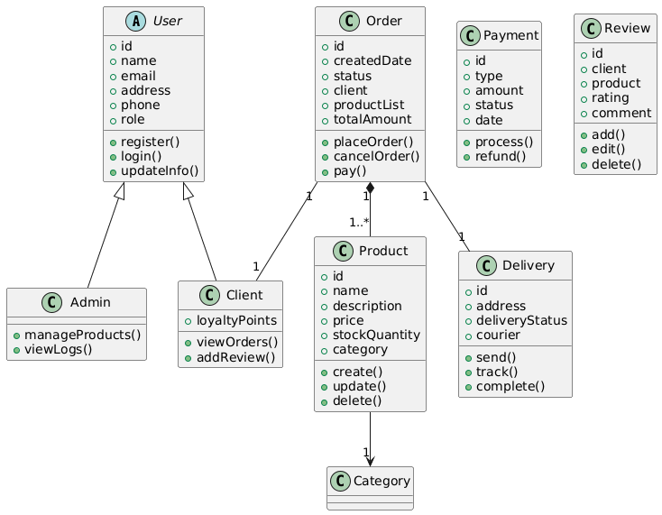
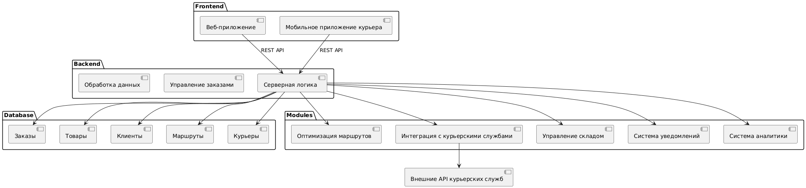

# Module11-UML

Этот репозиторий содержит задания по Модулю 11 — UML диаграммы для системы электронной коммерции и системы логистики.

## Файлы

- `diagrams/ecommerce_class_diagram.puml` — UML-диаграмма классов интернет-магазина.
- `diagrams/logistics_component_diagram.puml` — UML-диаграмма компонентов системы логистики.

## Диаграммы

### Диаграмма классов

### Диаграмма компонентов

